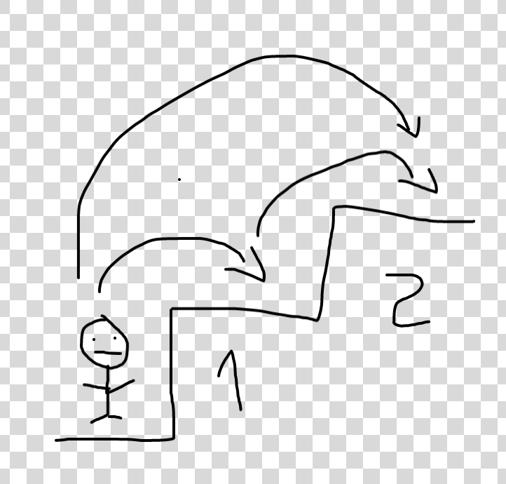
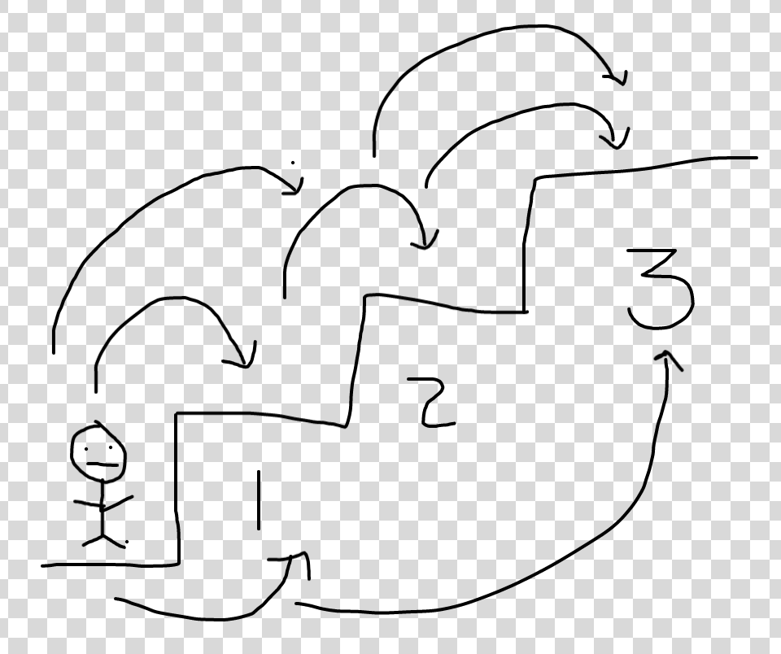
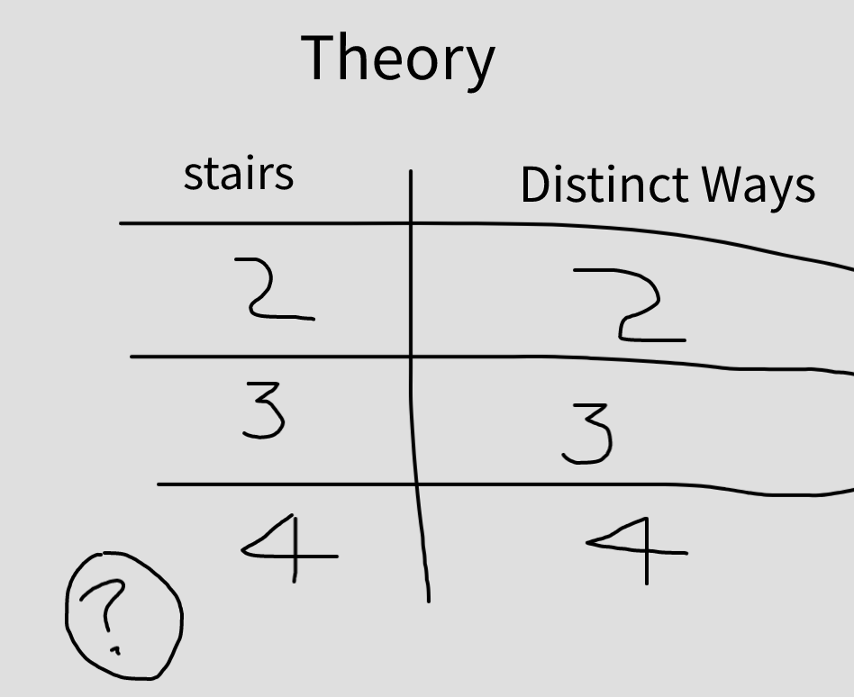
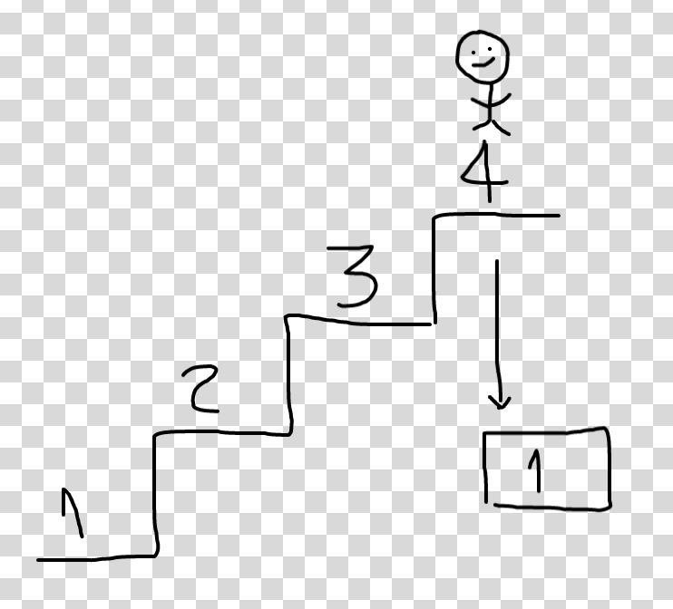
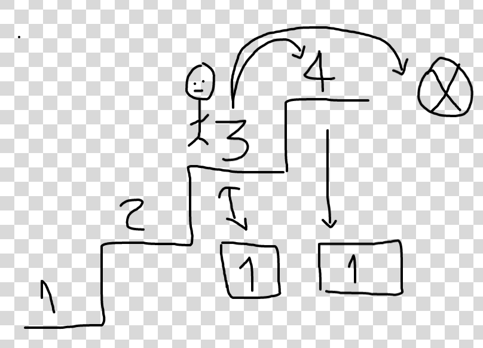
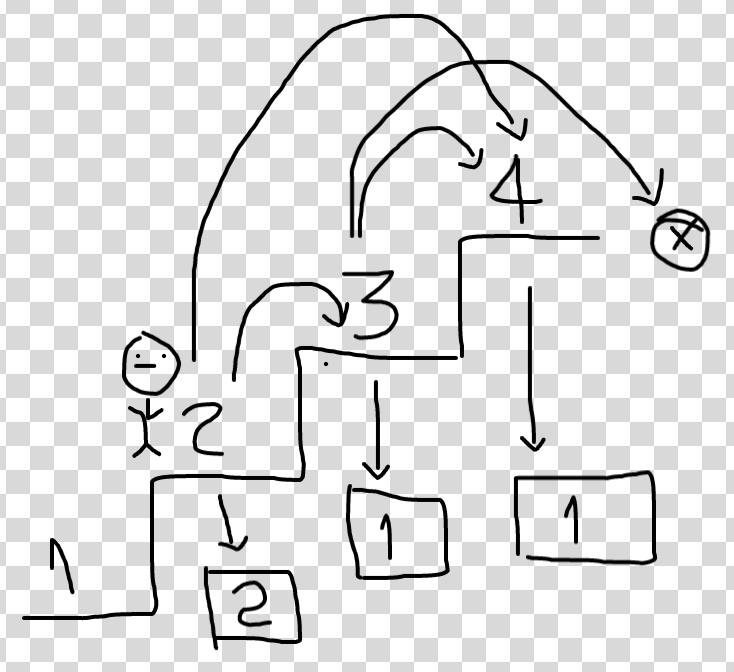
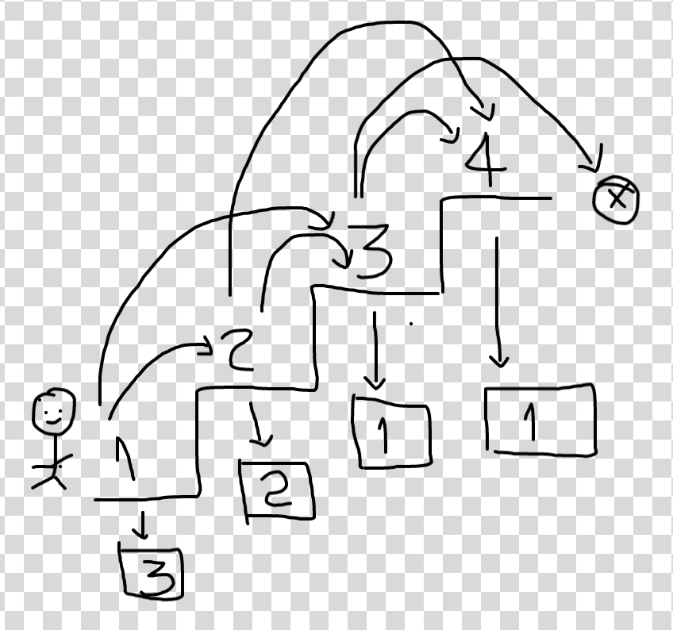
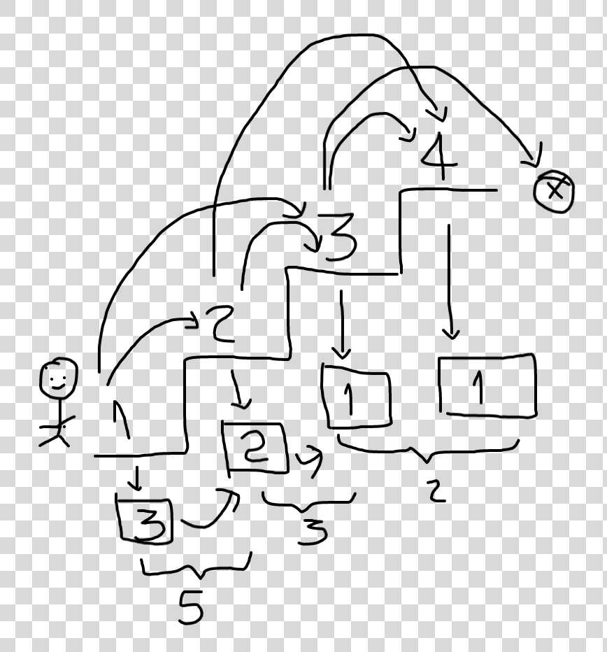
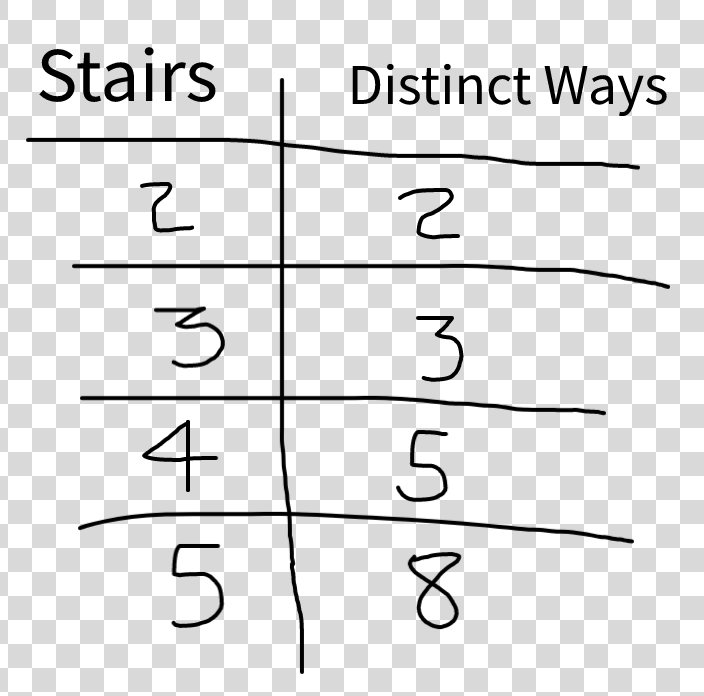

# 1 - Intuition
<!-- Describe your first thoughts on how to solve this problem. -->
- Problem:
  
The problem here we deling with is that:
<br>
You are climbing a staircase. It takes ```n``` steps to reach the top.

Each time you can either climb``` 1``` or``` 2``` steps. In how many distinct ways can you climb to the top?

Example 1:
```
Input: n = 2
Output: 2
Explanation: There are two ways to climb to the top.
1. 1 step + 1 step
2. 2 steps
```
Example 2:
```
Input: n = 3
Output: 3
Explanation: There are three ways to climb to the top.
1. 1 step + 1 step + 1 step
2. 1 step + 2 steps
3. 2 steps + 1 step
```
 From the example we can see that if there are two stairs then number of ways to reach the top are two. i.e, climbing one step each or climbing 2 steps. 
 

 From example 2, if we have 3 stairs then the number of ways to reach the top are 3, i.e., first way will be climbing one step each, second way will be first climb one step and the two steps and the third way will be first climb 2 steps and then climb one step. 
 

The first thoughts that came to mind to solve this problem were wage, i.e, whether to use hash map or hash set or something else. 

```
HashMap is in Java, not C#. The equivalent of HashMap in C# is Dictionary that is used as a collection of key-value pair.
Firstly, set the Dictionary −

Dictionary<string, int> d = new Dictionary<string, int>();

d.Add("soccer", 1);
d.Add("cricket", 2);
d.Add("tennis", 3);
d.Add("rugby", 4);
Now get the keys and sort them using ToList() and Sort() method respectively.

// get keys
var val = d.Keys.ToList();

// sort
val.Sort();

```
So, if we look at the related topics to this problem, we see Math, Dynamic Programming and Memoization.

So, 
"Dynamic Programming is mainly an optimization over plain recursion. Wherever we see a recursive solution that has repeated calls for same inputs, we can optimize it using Dynamic Programming. The idea is to simply store the results of subproblems, so that we do not have to re-compute them when needed later. This simple optimization reduces time complexities from exponential to polynomial." 
[for more details go to https://www.geeksforgeeks.org/dynamic-programming/](https://www.geeksforgeeks.org/dynamic-programming/)

For example, if we write simple recursive solution for Fibonacci Numbers, we get exponential time complexity and if we optimize it by storing solutions of subproblems, time complexity reduces to linear.

And " Memoization, in programing, is an optimization technique that makes applications more efficient and hence faster. It does this by storing computation results in cache, and retrieving that same information from the cache the next time it's needed instead of computing it again."
[for more details go to www.freecodecamp.org](https://www.freecodecamp.org/news/memoization-in-javascript-and-react/#:~:text=In%20programming%2C%20memoization%20is%20an,instead%20of%20computing%20it%20again.)

# 2 -  Approach
<!-- Describe your approach to solving the problem. -->
 My approach to solv this problem was to go to drawing board and make a theory.
 So, lets create a theory

  
 From the examples given, we see that if there are two stairs then there are two distinct ways to climb to the top and if there are three stairs then there are three distinct ways to go to the top. So, looking at the same pattren we can assume that if there are four stairs then there will be four distinct ways to go to the top.

 So, this is the theory. This can be true, or if it is not true then we have to look for other ways.

 So far we have gone from left to right to approach the problem. Let's go from right to left and see if we get an other idea to approach this problem.

 So, if we have four stairs and we are at the top, then the question is how many distinct ways to go on top when we are at top, so the answer will be one, as we don't move and we are already on top and the distinct way is one, i.e., do nothing and stay there.
   
If we are on stair three, there is also one 
distinct way to go to top, i.e., we take one step from third stair to fourth stair. we can not take to two steps as it will be out of bound which is not allowed. 
    
So, still no enough data. Let's go to second stair and see how many distinct ways we have to go to the top. One way is we take two steps and go to the top. We can take one step and go to third stair, now thrid stair knows how many steps to take to go to the top, i.e., one way. 
So, when we are at stair two, we have two distinct ways to go to top. The intresting point here is when we go to third stair and the third stair knows how many ways to to to the top, i.e., one way as that we have stored in memory of third stair. If we manage to get to thrid stair that means that the third stair can take over then we have two distinct ways to get to third stair and third stair has one way to get to the top, so in reality we have three distinct ways to get to the top. This is called memorization as we have stored these values in the memory. 
     
Let's go to stair one. We have one distinct way that we take one step and go to second stair and it has two distinct ways to go to top and we can take two steps and go to third stair and it has one distinct way to go to the top. So we have three distinct ways to go to top. 
      
So according to our theory the number of distinct ways to go to top from second stair are the sum of distinct ways to go to top from stair three and four, i.e., one plus one equals two ways. Similarly from stair one to stair four, the number of distinct ways are the sum of distinct ways from stair two to stair four and from stair three to stair four, i.e., two plus one equals three. 

So, we can conclude that if we have four stairs then we have five distinct ways to go to top, i.e., the sum of ways from stair one to top and from second stair to top that are five and so on. as seen in figure below. 
  
 

# 3 - Code
We can code now according to our theory as follows: 
```
public class Solution {
    public int ClimbStairs(int n) {
        int [] distinctWays = new int [n+1];

            distinctWays[0] = 1;
            distinctWays[1] = 1;

            for( int i = 2; i <= n; i++)
            distinctWays[i] = distinctWays[i-1] + distinctWays[i-2];

            return distinctWays[n];
    }
}
```

 # 4 -  Complexity
- Time complexity:
<!-- Add your time complexity here, e.g. $$O(n)$$ -->
The time complexity is linear O(n) as we have one loop which is from 2 to n.
- Space complexity:
<!-- Add your space complexity here, e.g. $$O(n)$$ -->
The space complexity is linear O(n) as we are allocating the array 
```
int [] distinctWays = new int [n+1];
````
i.e., if n is 10 the we are allocating 40 bytes of space and with increasing number we have to allocate more space. 
